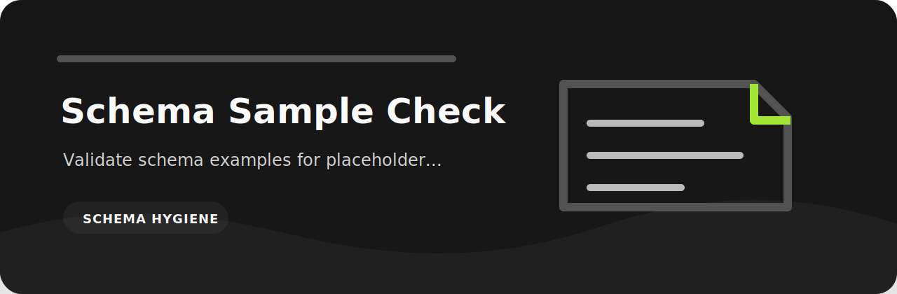

# Schema Sample Check

> A small command-line review pass for schema hygiene.



Validate schema examples for placeholder data and missing required samples. I keep it small because this kind of check is most useful when it can run beside the work, not after the work has already shipped.

## Signals in plain English

- `missing-required` (high): required example is missing. Fix: add sample for required field.
- `placeholder-data` (medium): placeholder example detected. Fix: use realistic example data.
- `unrealistic-flag` (low): example marked unrealistic. Fix: replace with representative sample.

## Input and report

The reader accepts text, JSON, JSONL, or CSV. The default report is readable in a terminal or pull request; `--json` keeps the same findings available to automation.

## Demo

```bash
git clone https://github.com/mertefekurt/schema-sample-check.git
cd schema-sample-check
python -m venv .venv
source .venv/bin/activate
python -m pip install -e ".[dev]"
schema-sample-check examples/sample.txt
schema-sample-check examples/sample.txt --json
```

## Sanity checks

```bash
ruff check .
pytest
python -m schema_sample_check --help
```
