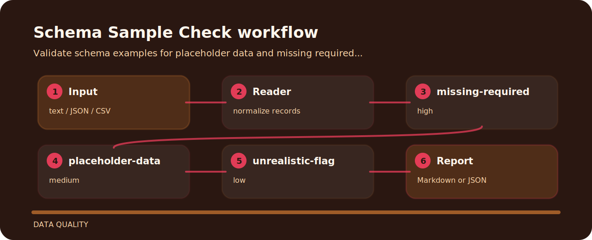

# Schema Sample Check

| Detail | Value |
| --- | --- |
| Area | data quality |
| Entry | `schema-sample-check` |
| Input | plain text |
| Output | terminal findings, optional JSON |


## What it protects

This repository turns a tiny plain text into reviewable signals for schema hygiene.

## Inspection line



## Signals

- `missing-required` - required example is missing (high); add sample for required field.
- `placeholder-data` - placeholder example detected (medium); use realistic example data.
- `unrealistic-flag` - example marked unrealistic (low); replace with representative sample.

## Fresh clone path

```bash
git clone https://github.com/mertefekurt/schema-sample-check.git
cd schema-sample-check
python -m pip install -e ".[dev]"
schema-sample-check examples/sample.txt
```
